# Git Flow step by step

## Create the primary branches

We need a branch for releases and a branch for development. Here I will use the
name `main` and `develop` respectively.

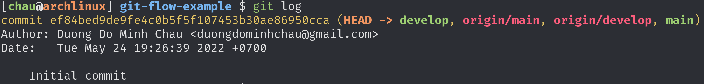

Because we will regularly need to merge into `develop`, it should be marked as
the default branch to save time. On GitHub we can configure that here:

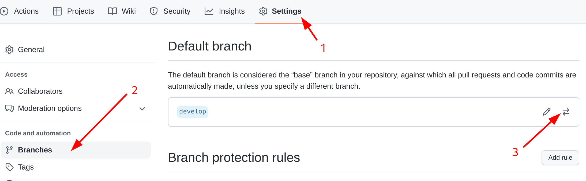

## Feature/bugfix flow

We will create two feature branches. Each Pull Request will add an author into
the `README.md`. These branches will be created from `develop` and will also be
merged back to `develop`.

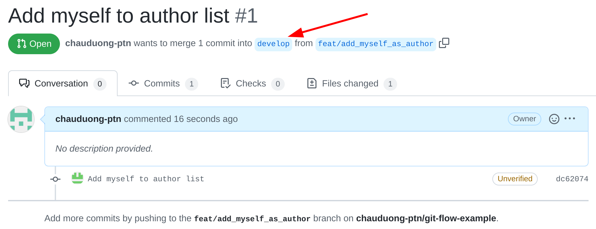

- First PR: <https://github.com/chauduong-ptn/git-flow-example/pull/1>
- Second PR: <https://github.com/chauduong-ptn/git-flow-example/pull/2>

I'll merge the second PR first.

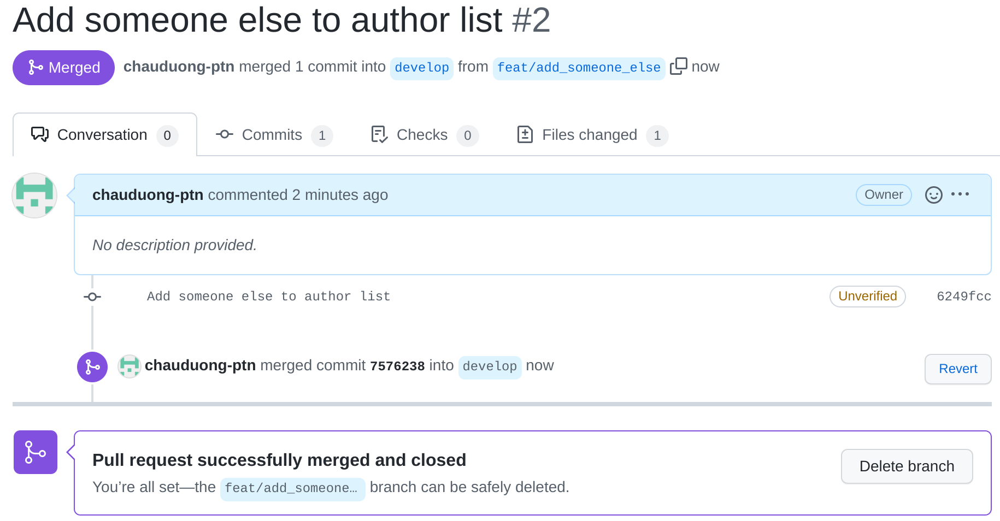

This will make `develop` conflicts with the first PR.

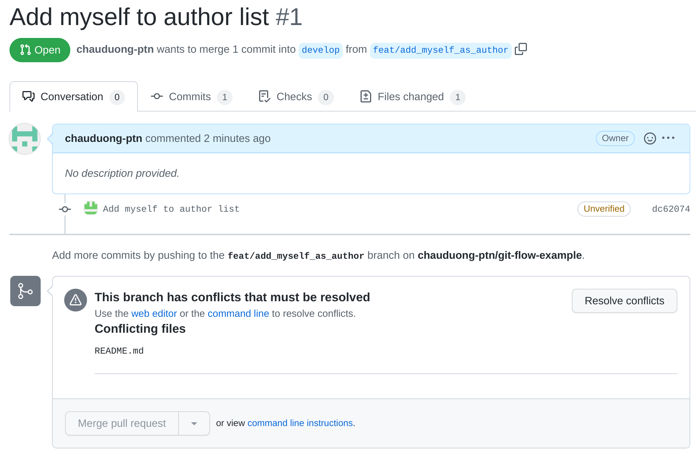

We will need to resolve this first. The easiest way is just merge `develop` into
the feature branch.

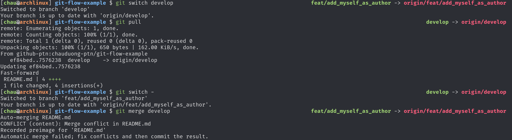

Here's how the conflict looks like:

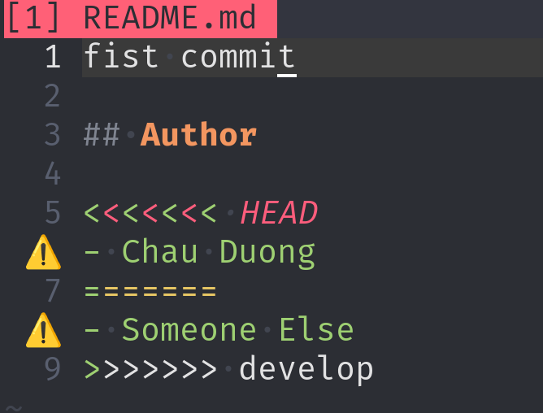

We will resolve it like this:

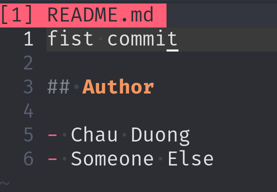

Then commit and push the resolution to GitHub.

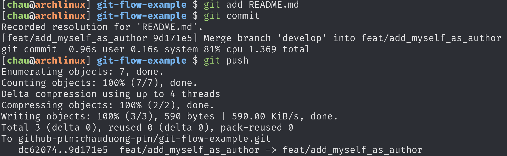

The PR is mergeable now.

At this point, `develop` is ahead of `main`

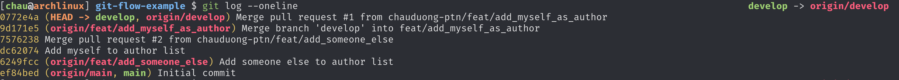

## Release flow

We already have some changes to release, in this section we will make a release.
Release branch is created from `develop` (because that's where we merged new
changes into).

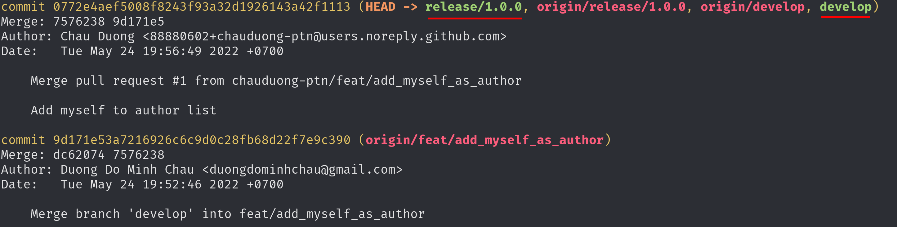

If any issue is found during release testing, we will create feature branch to
fix it, but we create it from release branch and merge back to release branch
instead of `develop`.

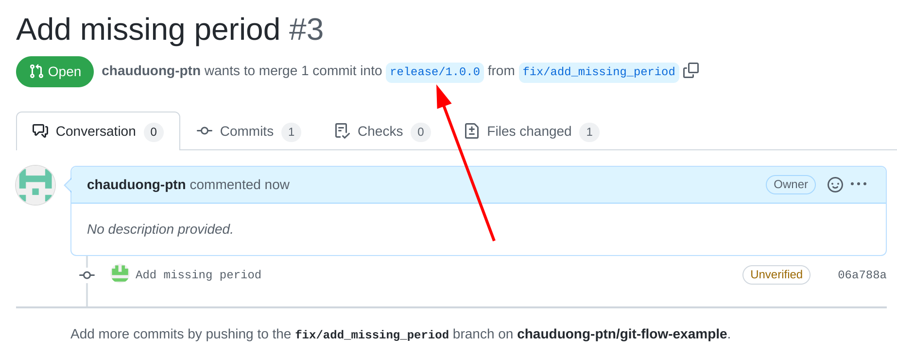

When it's ready we will merge the release branch into `main` (to make a new
release) and `develop` (to get the release issues fixes).

PR to `develop`: <https://github.com/chauduong-ptn/git-flow-example/pull/4>

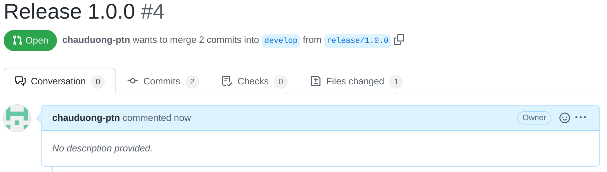

PR to `main`: <https://github.com/chauduong-ptn/git-flow-example/pull/5>

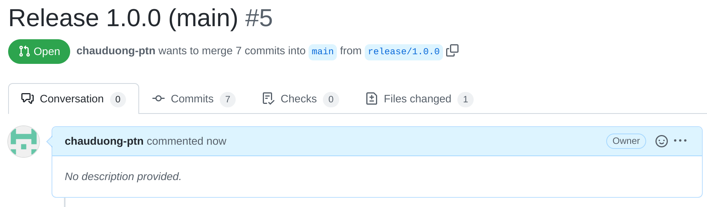

Usually people will also tag the new commit on `main` using the version number,
but we will skip that here.

## Hotfix flow

When there is an urgent issue, we need to fix and release as soon as possible.
To do that, we create a hotfix branch from `main` (because that branch contains
all the release commits), do the fix, then merge back to `main` and `develop`.

PR to `develop`: <https://github.com/chauduong-ptn/git-flow-example/pull/6>

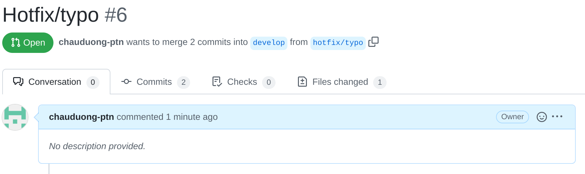

PR to `main`: <https://github.com/chauduong-ptn/git-flow-example/pull/7>

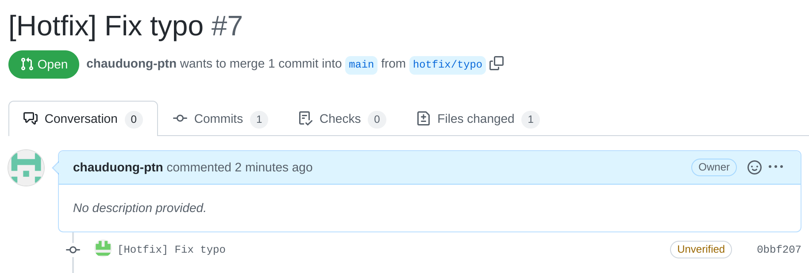

If you look at the PR to `develop`, there is an extra merge commit. This will
quickly become hard to manage, so in practice people usually create **two**
branches with the same content for a hotfix, one from `main` and will be merged
to `main`, the other from `develop` and will be merged to `develop`.

Each hotfix will be released as soon as possible, so after being merged, people
will also usually tag it with an increased version number, for example: when
current version is `v1.0.0`, after merged the hotfix people will tag the new
commit and release as `v1.0.1`.

## Conclusion

That's all we need to know about Git Flow. Although it is quite old and complex,
it is still widely used, so it's worth spending a few minutes understanding how
to work with Git Flow.
